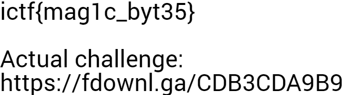
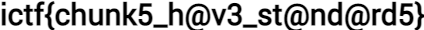

# broken-png1

- **Description:** First problem for the Fix Broken PNG series.
  But before that, solve `broken-png0`.

- **Attachments:** https://fdownl.ga/CB07F4AA2F

- **Category:** Forensics

- **Points:** 50

---

This challenge has two steps: broken-png0 and broken-png1.

## broken-png0

broken-png0 is a modified PNG file, broken0. Here is the file header:

```
00000000  58 58 58 58 0D 1A 0A 1A 00 00 00 0D 49 48 44 52  XXXX........IHDR
00000010  00 00 02 B6 00 00 00 C0 08 06 00 00 00 F1 E7 20  ...¶...À.....ñç 
00000020  19 00 00 20 00 49 44 41 54 78 5E ED 9D 07 B4 24  ... .IDATx^í..´$
```

The header has been tampered: according to the [PNG specifications](http://www.libpng.org/pub/png/spec/1.2/PNG-Structure.html), the first eight bytes of a PNG file always contain the following values:

> 89 50 4E 47 0D 0A 1A 0A

If we replace these 8 bytes in broken0, image is correct and can be correctly displayed:



Solution: ictf{mag1c_byt35}

## broken-png1

The link in the repaired broken0 image leads to another PNG, broken1. Again, this image has to be fixed. Here the file header seems correct:

```
00000000  89 50 4E 47 0D 0A 1A 0A 00 00 00 0D 4C 53 44 52  ‰PNG........LSDR
00000010  00 00 01 A8 00 00 00 1E 08 06 00 00 00 79 56 8A  ...¨.........yVŠ
00000020  1C 00 00 1D 45 55 44 45 54 78 5E ED DD 09 B8 BD  ....EUDETx^íÝ.¸½
00000030  D5 F4 07 F0 1D 11 11 85 42 22 25 94 92 39 CA 4C  Õô.ð...…B"%”’9ÊL
```

However, the file is still invalid. A PNG file is composed of an eight-byte header (the PNG signature), and  a series of *chunks*. Each chunk is composed of four parts:

- Length, a 4-byte unsigned integer, encoded in big endian.
- A chunk type.
- Chunk data.
- A 4-byte CRC.

Chunk types are standard. First chunk type must be "IHDR", and the last one must be "IEND". On the dump above, we see that the first chunk does not have an "IHDR" type, but "LSDR", which is an incorrect type.

Manually checking if each chunk is valid is a tedious process. This work can be automated with a tool provided by libpng.org, [pngcheck](http://www.libpng.org/pub/png/apps/pngcheck.html). It automatically spots inconsistencies in a given PNG file:

```shell
$ pngcheck broken1
broken1  first chunk must be IHDR
ERROR: broken1
```

Let's replace "LSDR" with "IHDR" in our file. It still cannot be open. If we run pngcheck again, we get:

```shell
$ pngcheck broken1
broken1-fixed.png  illegal (unless recently approved) unknown, public chunk UDET
ERROR: broken1-fixed.png
```

Looking at the previous file broken0, we can see that its previous chunk was of type "IDAT". This kind of chunk contains the actual image data (see [Chunk Specifications](http://www.libpng.org/pub/png/spec/1.2/PNG-Chunks.html)). Let's replace "UDET" with "IDAT" in our file:

```shell
$ pngcheck broken1
broken1-fixed.png  illegal (unless recently approved) unknown, public chunk AEND
ERROR: broken1-fixed.png
```

Now we see an invalid chunk "AEND". It is located at the very end of the file. As explained above, the last chunk of a PNG file must have an "IEND" type. Replacing "AEND" with "IEND" in the file fixes the image:

```shell
$ pngcheck broken1-fixed.png
OK: broken1-fixed.png (424x30, 32-bit RGB+alpha, non-interlaced, 85.2%).
```

The picture can now be correctly displayed. It contains the flag:



Solution: ictf{chunk5_h@v3_st@nd@rd5}