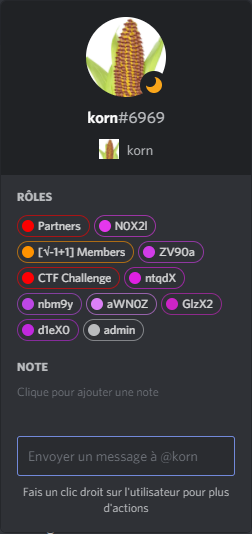

# Hoi
- **Description:** Korn
- **Attachments:** None
- **Category:** OSINT
- **Points:** 50
---

There are no attachments in this challenge. The single indication we have to solve the challenge is "Korn", which is the nick of a member of the Discord server.

By looking at his roles on the server, we can see several "strange" entries:



This looks like chunks of base 64 encoded data. If we try to decode them separately, we see that one of them, "aWN0Z", is decoded to "ictd", which really looks like "ictf" (only a few bits are missing to form "ictf"). Other ones look like random data. We know we are in the right direction.

To solve the challenge, one has to try to combine the chunks in every possible manner in order to get a valid flag after base 64 decoding. We know a valid flag starts with "`ictf{`" and ends with "`}`". That helps to filter most of the invalid entries.

The script to test all the possible permutations is quite straightforward (see [solve_hoi.py](solve_hoi.py)). Script checks if the data, after being decoded from base 64, can be decoded to ASCII, and if it starts with "`ictf{`" and ends with "`}`".

```python
flag_parts = ("N0X2l", "ZV90a", "ntqdX", "nbm9y", "aWN0Z", "GlzX2", "d1eX0")
for perm in itertools.permutations(flag_parts, len(flag_parts)):
    candidate = base64.b64decode("".join(perm) + "=")
    try:
        flag = candidate.decode("ascii")
        if flag.startswith("ictf{") and flag.endswith("}"):
            print(flag)
    except UnicodeDecodeError:
        pass
```

There is only one valid candidate, which is the correct flag.

Solution: ictf{just_ignore_this_guy}