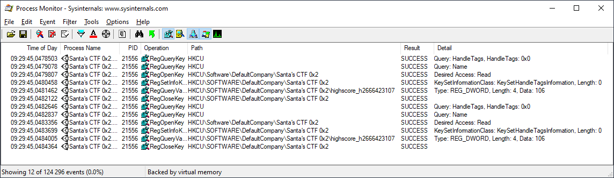
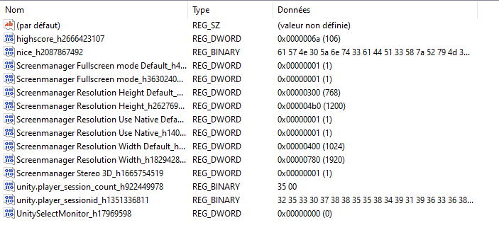

# Santa's CTF 0x2

- **Description:** Second challenge of Unity Hacking series
- **Attachments:** https://fdownl.ga/C8897A696C
- **Category:** Game Hacking
- **Points:** 150

---

This challenge is a simple lottery game. There is a single button, "PLAY". When it is clicked, a random number between 0 and 100 is drawn and displayed. The High Score is eventually updated.

## An Easy Method

There is no hint about the flag. We can look at two things:

- How the number is generated, and check if a given high score will display the flag.
- High score is saved. When the game is restarted, the high score stays the same. Anyway, the sentence displayed at the bottom of the game makes us think this is the right direction:

> Maybe you will want to restart the game...

Where is stored the high score? The location can be identified with ProcMon. A click on "Play" triggers the following events:



High scores are saved in the game preferences, in the Windows registry. There are a dozen entries in the HKCU\SOFTWARE\DefaultCompany\Santa's CTF 0x2 key:



The nice_h2087867492 entry contains a base64 string. The decoded content is the flag.

```python
>>> base64.b64decode("aWN0Znt3aDQ3XzRyM195MHVyX3ByM3MzbnRfcHIzZjNyM25jM3M/fQ==")
b'ictf{wh47_4r3_y0ur_pr3s3nt_pr3f3r3nc3s?}'
```

## Alternative Method

I did not notice the high score was saved between instances. My bet was that to get the flag, you had to generate a high score greater than 100. So I looked at how the number was randomly selected.

Game logic is located in the GameAssembly.dll file. This library contains native code that is called from Unity scripts. The script that calls these functions is, for this game, "level0". This can be seen by looking at the strings it contains:

```shell
$ strings Santa\'s\ CTF\ 0x2_Data/level0
[...]
Selected
Disabled
GenerateRandomScore
UnityEngine.Object, UnityEngine
High Score: 0
PLAY
Maybe you will want to restart the game...
```

How does the script call the GameAssembly library? The GenerateRandomScore function is not directly exported by the library. Metadata required to do the mapping between a method name, its arguments, and its offset in the library is stored in a separate file, il2cpp_data\Metadata\global-metadata.dat. This data can be dumped with [Il2CppDumper](https://github.com/Perfare/Il2CppDumper).

This tool produces a JSON file, which can be imported into reverse engineering tools like Ghidra or IDA. Functions are then automatically renamed. That way, we can locate the GenerateRandomScore function. Its internal name is actually "`Logic$$GenerateRandomScore`". Analyzing it shows that it does not perform something particular: it just generated a number between 1 and 100, and calls the `Logic$$UpdateHighScore` function which updates the high score.

It can be noticed that all the user defined function starts with "`Logic$$`", the other functions being Unity standard library functions. There are only four such functions:

- `Logic$$GenerateRandomScore` which generates a number between 1 and 100.
- `Logic$$UpdateHighScore` which updated the high score.
- `Logic$$_ctor`, the constructor which only calls the UnityEngine::MonoBehaviour constructor.
- `Logic$$Awake`. 

The latter function is the one we are looking for: it looks for the "nice" entry in the player preferences, and, if it is not present, sets it to the value `aWN0Znt3aDQ3XzRyM195MHVyX3ByM3MzbnRfcHIzZjNyM25jM3M/fQ==`. This value is the flag, encoded in base 64, as we saw before:

```assembly
il2cpp:1049FBE0 Logic$$Awake    proc near               ; DATA XREF: .data:off_1065185C↓o
il2cpp:1049FBE0
il2cpp:1049FBE0 arg_4           = dword ptr  0Ch
il2cpp:1049FBE0
il2cpp:1049FBE0                 push    ebp
il2cpp:1049FBE1                 mov     ebp, esp
il2cpp:1049FBE3                 cmp     byte_106558F5, 0
il2cpp:1049FBEA                 jnz     short loc_1049FC01
il2cpp:1049FBEC                 push    ds:dword_104FEC4C
il2cpp:1049FBF2                 call    sub_100DCA20
il2cpp:1049FBF7                 add     esp, 4
il2cpp:1049FBFA                 mov     byte_106558F5, 1
il2cpp:1049FC01
il2cpp:1049FC01 loc_1049FC01:                           ; CODE XREF: Logic$$Awake+A↑j
il2cpp:1049FC01                 push    0
il2cpp:1049FC03                 push    StringLiteral_3842 ; highscore
il2cpp:1049FC09                 call    UnityEngine_PlayerPrefs$$HasKey
il2cpp:1049FC0E                 add     esp, 8
il2cpp:1049FC11                 test    al, al
il2cpp:1049FC13                 jnz     short loc_1049FC27
il2cpp:1049FC15                 push    0
il2cpp:1049FC17                 push    0
il2cpp:1049FC19                 push    StringLiteral_3842 ; highscore
il2cpp:1049FC1F                 call    UnityEngine_PlayerPrefs$$SetInt
il2cpp:1049FC24                 add     esp, 0Ch
il2cpp:1049FC27
il2cpp:1049FC27 loc_1049FC27:                           ; CODE XREF: Logic$$Awake+33↑j
il2cpp:1049FC27                 push    0
il2cpp:1049FC29                 push    StringLiteral_3843 ; nice
il2cpp:1049FC2F                 call    UnityEngine_PlayerPrefs$$HasKey
il2cpp:1049FC34                 add     esp, 8
il2cpp:1049FC37                 test    al, al
il2cpp:1049FC39                 jnz     short loc_1049FC51
il2cpp:1049FC3B                 push    0
il2cpp:1049FC3D                 push    StringLiteral_3844 ; aWN0Znt3aDQ3XzRyM195MHVyX3ByM3MzbnRfcHIzZjNyM25jM3M/fQ==
il2cpp:1049FC43                 push    StringLiteral_3843 ; nice
il2cpp:1049FC49                 call    UnityEngine_PlayerPrefs$$SetString
il2cpp:1049FC4E                 add     esp, 0Ch
il2cpp:1049FC51
il2cpp:1049FC51 loc_1049FC51:                           ; CODE XREF: Logic$$Awake+59↑j
il2cpp:1049FC51                 mov     [ebp+arg_4], 0
il2cpp:1049FC58                 pop     ebp
il2cpp:1049FC59                 jmp     Logic$$UpdateHighScore
il2cpp:1049FC59 ; ---------------------------------------------------------------------------
il2cpp:1049FC5E                 align 10h
il2cpp:1049FC5E Logic$$Awake    endp
```

Solution: ictf{wh47_4r3_y0ur_pr3s3nt_pr3f3r3nc3s?}
