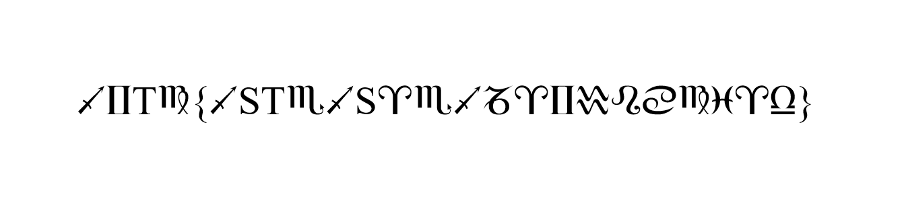
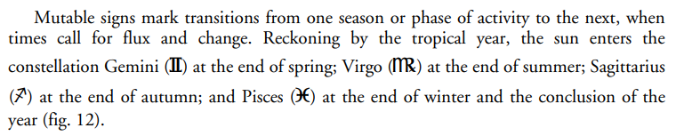

# zodiac

- **Description:** What do these symbols mean? Can you figure it out? All the letters within braces are uppercase.
  (**Note:** This has nothing to do with Z-340, which got solved recently. It is a good read though.)

- **Attachments:** https://fdownl.ga/35DEF4DAF7
- **Category:** Misc
- **Points:** 100

---

The challenge is an image:

It looks like an encrypted message. The braces, and the four symbols before the left brace, make us think the plaintext is `ictf{<19 chars>}`: each character seems to be encoded with a Zodiac sign.

There are only 12 Zodiac signs. If the hypothesis is correct, only 12 letters can be encoded as a Zodiac sign. That would explain why several letters like "S" and "T" are not encoded.

If we consider each character is encoded with the same Zodiac sign (:sagittarius: for i, for example, :gemini: for c, etc.), we get the following plaintext. We guess the message starts with ictf:

| :sagittarius: | :gemini: | T    | :virgo: | {    | :sagittarius: | S    | T    | :scorpius: | :sagittarius: | S    | :aries: | :scorpius: | :sagittarius: | :capricorn: | :aries: | :gemini: | :aquarius: | :leo: | :cancer: | :virgo: | :pisces: | :aries: | :libra: | }    |
| ------------- | -------- | ---- | ------- | ---- | ------------- | ---- | ---- | ---------- | ------------- | ---- | ------- | ---------- | ------------- | ----------- | ------- | -------- | ---------- | ----- | -------- | ------- | -------- | ------- | ------- | ---- |
| i             | c        | t    | f       | {    | i             | s    | t    |            | i             | s    |         |            | i             |             |         | c        |            |       |          | f       |          |         |         | }    |

The beginning of the message could be "IS THIS", if :scorpius: maps to the "h" letter. The encoding sounds really plausible. My final supposition was that these Zodiac signs were actually a font. I saw challenges which used symbol fonts, such as [Wingdings](https://en.wikipedia.org/wiki/Wingdings), in the past. So I Googled for "sagittarius i", "gemini c", and found a [document](https://link.springer.com/content/pdf/10.1007/s00004-008-0106-x.pdf) which embeds a font with the same encoding:

The raw text (once copied on clipboard) is actually:

>  Mutable signs mark transitions from one season or phase of activity to the next, when times call for flux and change. Reckoning by the tropical year, the sun enters the constellation Gemini **(c)** at the end of spring; Virgo **(f)** at the end of summer; Sagittarius **(i)** at the end of autumn; and Pisces **(l)** at the end of winter and the conclusion of the year (fig. 12)

As one can see, each character is encoded the same way as the ciphertext.

The next step is to extract the font embedded in the PDF. Several tools can do that. I used an online service, https://www.extractpdf.com/. The embedded font is called "COPBBG+AstroGadget.ttf", and is also available on dafont.com: https://www.dafont.com/astro-gadget.font

Knowing the character map, we can now completely decode the ciphertext and retrieve the flag:

| :sagittarius: | :gemini: | T    | :virgo: | {    | :sagittarius: | S    | T    | :scorpius: | :sagittarius: | S    | :aries: | :scorpius: | :sagittarius: | :capricorn: | :aries: | :gemini: | :aquarius: | :leo: | :cancer: | :virgo: | :pisces: | :aries: | :libra: | }    |
| ------------- | -------- | ---- | ------- | ---- | ------------- | ---- | ---- | ---------- | ------------- | ---- | ------- | ---------- | ------------- | ----------- | ------- | -------- | ---------- | ----- | -------- | ------- | -------- | ------- | ------- | ---- |
| i             | c        | t    | f       | {    | i             | s    | t    | h          | i             | s    | a       | h          | i             | j           | a       | c        | k          | e     | d        | f       | l        | a       | g       | }    |

Solution: ictf{ISTHISAHIJACKEDFLAG}